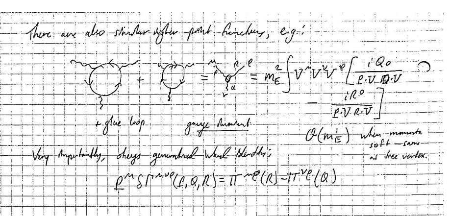

Ten hours of lectures on the formalism of in-medium field theory as applied to cold quark matter at high densities. Given as part of [QCD Master Class 2023](https://indico.cern.ch/event/1174608/timetable/#20230605) in Saint-Jacut-de-la-Mer, France. Topics covered: (i) framework of relativistic thermal and high‑density perturbation theory, (ii) infrared problems in thermal field theory and their resolution for the pressure, (iii) the general structure of the perturbative QCD pressure, and (iv) current status of theoretical calculations.